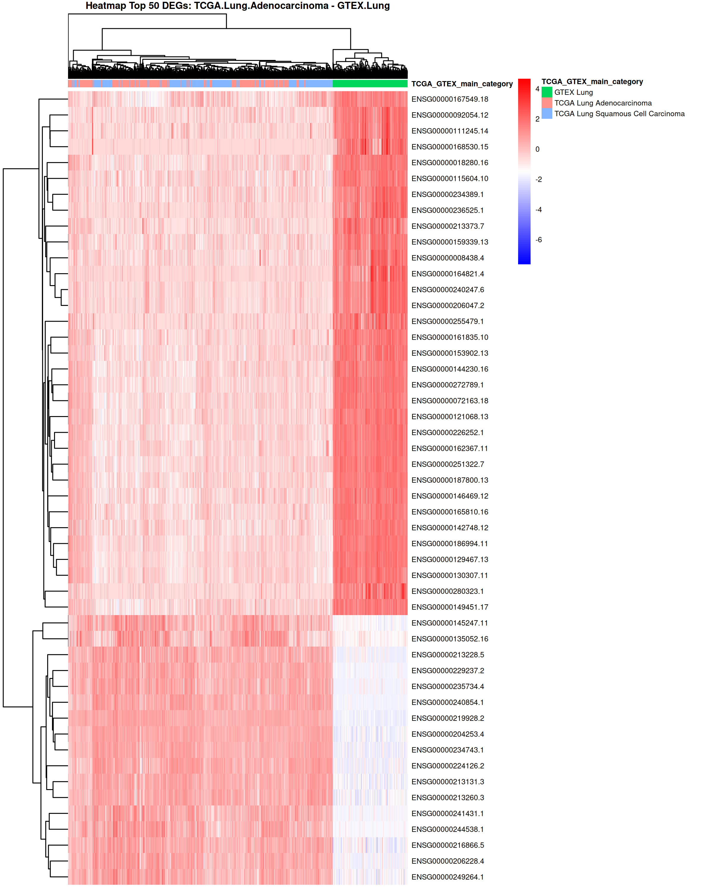

# Documentación Técnica: Interpretacion de resutlados

## Heatmap

Esta seccion  describe los principios técnicos y biológicos para interpretar los mapas de calor generados por la función ***create_heatmap*** dentro del archivo `dea_functions.R`. Esta funcion fue diseñada para visualizar los genes diferencialmente expresados (DEGs) obtenidos mediante un análisis de expresión diferencial (DEA) entre cohortes de TCGA y GTEx.  

El heatmap es una representación sintética de la matriz de expresión. A diferencia de una tabla de datos, permite visualizar la consistencia biológica entre réplicas y detectar patrones de co-expresión génica.  

El objetivo es representar la intensidad de expresión de los Top N genes más significativos, permitiendo observar patrones de agrupamiento entre las muestras analizadas.  

### Parámetros de Entrada

| Parámetro | Tipo | Descripción |
|---|---:|---|
| full_matrix | Matrix | Matriz de expresión donde las filas son genes y las columnas muestras. |
| results_df | Data.frame | Tabla de resultados del DEA (salida de limma) que debe contener columnas logFC y adj.P.Val. |
| metadata | Data.frame | Datos clínicos/anotaciones de las muestras. |
| group_col | String | Nombre de la columna en la metadata que define los grupos (ej. "TCGA_GTEX_main_category"). |
| comparison_name | String | Título descriptivo para el gráfico y nombre de archivo. |
| top_n | Integer | Cantidad de genes con menor p-value ajustado a mostrar. |
| logFC_threshold | Numeric | Umbral mínimo de Fold Change para considerar un gen como relevante. |
| p_threshold | Numeric | Umbral máximo de p-value ajustado (FDR). |

### Lógica de Procesamiento Interno

El codigo realiza tres procesos críticos antes de pintar el gráfico:  

1. Filtrado de Significancia: Selecciona solo los 50 genes que tienen mayor relevancia estadística (adj.P.Val < 0.05) y un cambio de magnitud importante (|logFC| > 1). Los genes resultantes se ordenan por significancia y se seleccionan los primeros top_n.  
2. Normalización Z-score: Esto transforma los valores de conteo en unidades de desviación estándar.Un valor de 2 (rojo) significa que ese gen se expresa 2 desviaciones estándar por encima de su media en esa muestra.Un valor de -2 (azul) significa que está muy por debajo de su media. [Ver sección Consideraciones Estadísticas Avanzadas](#consideraciones-estadísticas-avanzadas).  
3. Anotación y Clustering Jerárquico: Organiza las filas y columnas por similitud, agrupando lo que se comporta de forma parecida:
   1. Clustering Jerárquico: Se aplica tanto a filas como a columnas utilizando la distancia euclidiana por defecto. Esto agrupa automáticamente muestras con perfiles de expresión similares.
   2. Anotación: Se añade una barra de color superior basada en la metadata para identificar visualmente a qué grupo pertenece cada muestra.

### Interpretación de Resultados

1. Escala de Colores (Z-Score)
   - Rojo (Positivo): Indica que el gen está sobreexpresado (up-regulated) en esa muestra en comparación con el promedio de todas las muestras del heatmap.  
   - Azul (Negativo): Indica que el gen está subexpresado (down-regulated) respecto al promedio.  
   - Blanco: Expresión cercana a la media.  
2. Agrupamiento de Columnas (Muestras)  
   Si el DEA es biológicamente robusto, el dendrograma superior debería separar claramente las muestras por su categoría (ej. el bloque de muestras de Adenocarcinoma debería agruparse lejos de las muestras de tejido normal de GTEx). Si las muestras aparecen mezcladas, podría indicar:  
   1. Baja pureza tumoral en las muestras de TCGA.  
   2. Efecto de lote (batch effect) entre TCGA y GTEx.  
   3. Heterogeneidad biológica intrínseca.  
   Ver seccion [Consideraciones Estadísticas Avanzadas](#consideraciones-estadísticas-avanzadas) para entender la relacion del grafico PCA con este agrupamiento.  
3. Agrupamiento de Filas (Genes)  
   Los genes que se agrupan juntos suelen compartir funciones biológicas o vías de señalización. El heatmap permite identificar visualmente "firmas génicas" o bloques de genes que se activan o desactivan de manera coordinada entre las patologías analizadas (ej. Tejido Sano de Pulmon vs Squamous Cell Carcinoma).

#### Ejemplo de salida

A continuación se muestra el heatmap generado para la comparación TCGA Lung Adenocarcinoma vs GTEx Lung (Top 50 genes):

Figura: Heatmap con valores Z-score por gen (filas) y muestras (columnas). Colores: rojo = sobreexpresión relativa, azul = subexpresión relativa. Las barras de color superiores representan la anotación por grupo. Los dendrogramas indican agrupamientos jerárquicos; ramas cercanas reflejan perfiles de expresión similares.

### Consideraciones Estadísticas Avanzadas

1. Rango de la Normalización Z-score  
   Es un error pensar que el Z-score está limitado al rango [-2, 2]. Matemáticamente, el Z-score no tiene un límite superior o inferior definido; depende totalmente de la distribución de los datos originales. La fórmula aplicada es: Z = (X-μ)/σ.  
   Interpretación probabilística: Si los datos siguieran una distribución normal perfecta, el 95% de los valores caerían entre -1.96 y 1.96. Debido a la alta variabilidad biológica y técnica, es frecuente encontrar valores fuera de este rango (outliers). Si un gen tiene un Z-score de 4, significa que su expresión en esa muestra es 4 desviaciones estándar por encima de la media, lo cual es un hallazgo biológicamente potente. 
   Visualización: En el heatmap, los colores suelen saturarse en los extremos (ej. todo lo mayor a 2 es rojo intenso y menor a -2 es azul intenso) para evitar que un solo outlier opaque la variación del resto de las muestras.

2. Correlación entre Clustering y PCA  
   El Agrupamiento Jerárquico de columnas en el heatmap y el Análisis de Componentes Principales (PCA) son herramientas complementarias pero operan bajo la misma premisa: la distancia biológica.
   La logica diría que si en el PCA se ve que las muestras de "GTEX.Lung" se separan claramente de las de "TCGA.Lung.Adenocarcinoma" en el componente principal 1 (PC1), el heatmap debe reflejar esto agrupando esas muestras en ramas separadas del dendrograma superior. Pero hay una diferencia clave: Mientras que el PCA utiliza la variabilidad de los 1000 genes más variables para posicionar las muestras en un plano, el heatmap se enfoca específicamente en los genes que ya sabemos que son distintos (los DEGs):  
   - Si el PCA muestra separación pero el heatmap no, es posible que el umbral de significancia del DEA sea demasiado laxo. 
   - Si el heatmap agrupa mejor que el PCA, significa que los DEGs seleccionados son los que realmente definen la identidad del tejido.

3. Lógica de Selección de Genes vs. Visualización
    Es fundamental distinguir entre cómo el modelo estadístico elige los genes y qué muestras se muestran en el gráfico:
    - Selección de Genes (El Contraste): Los genes se filtran basándose en un contraste estadístico específico (ej. Grupo A vs. Grupo B). El resultado (LogFC y p-valor) se calcula solo con esos dos grupos.
    - Visualización Global: Aunque los genes se eligen por ser diferentes entre A y B, el heatmap incluye a todos los grupos disponibles en la matriz. Esto permite observar el comportamiento de esos genes en una tercera condición (Grupo C), aportando contexto sobre la especificidad de la firma génica.  
    Ejemplo: Cuando incluimos un tercer grupo (ej. un segundo tipo de tumor) que no formó parte del contraste original, podemos obtener tres tipos de información:
    - Especificidad del Marcador: Si los genes son rojos en LUAD, azules en GTEx, y también azules en LUSC, significa que son biomarcadores específicos de Adenocarcinoma.
    - Firma Genérica de Cáncer: Si los genes son rojos tanto en LUAD como en LUSC, pero azules en GTEx, estamos ante una firma de proliferación tumoral general del pulmón.
    - Gradiente Biológico: Permite observar si el tercer grupo tiene un perfil intermedio, lo cual es común en estudios de progresión de enfermedades.

## Volcano Plot

El Volcano Plot es una herramienta de visualización bidimensional que permite identificar rápidamente los genes con cambios de expresión biológicamente significativos y estadísticamente robustos. Combina una medida de significancia estadística con la magnitud del cambio (Fold Change).

### Parámetros de Entrada

| Parámetro | Tipo | Descripción |
|---|---:|---|
| results | Data.frame | Tabla de resultados del DEA (salida de limma). |
| p_value_threshold | Numeric | Umbral de significancia para el eje Y (basado en adj.P.Val). |
| logFC_threshold | Numeric | Umbral de magnitud de cambio para el eje X (basado en logFC). |
| title | String | Título principal del gráfico. |
| top_genes_label | Integer | Cantidad de genes (ordenados por significancia) que recibirán etiqueta de texto. |

### Lógica de Procesamiento Interno

1. Categorización Binaria: La función crea una columna lógica *diff_expressed*. Un gen se marca como "YES" únicamente si cumple ambas condiciones simultáneamente: |log2FC| > p_value_threshold y  P-adj < p_value_threshold  
2. Transformación Logarítmica:  
   1. Eje X: Utiliza $log2 para que los cambios sean simétricos (un aumento del doble es +1, una disminución a la mitad es -1).  
   2. Eje Y: Aplica -log10 al valor de p ajustado. Esto permite que los valores más pequeños (más significativos) se ubiquen en la parte superior del gráfico.  
3. Etiquetado Inteligente: Para evitar la saturación visual, la función no etiqueta todos los genes significativos. Filtra el set de datos para identificar solo los *top_genes_label* genes con el p-valor más bajo y utiliza la librería ggrepel para posicionar los nombres sin que se solapen.

### Interpretación de Resultados

El gráfico se divide visualmente en cuadrantes definidos por las líneas punteadas (umbrales):  

- Superior Izquierda (Up-Left): Genes significativamente subexpresados (Down-regulated).
- Superior Derecha (Up-Right): Genes significativamente sobreexpresados (Up-regulated).
- Zona Inferior/Central: Genes que no alcanzan la significancia estadística o cuya magnitud de cambio es despreciable.

#### Ejemplo de salida

Figura: Volcano plot que muestra log2FC (eje X) frente a -log10(adj.P.Val) (eje Y). Los puntos destacados representan genes que superan los umbrales de |logFC| y ajuste de p; las etiquetas señalan los top genes más significativos.

### Consideraciones Estadísticas Avanzadas

1. LogFC vs. Z-Score
   Es importante notar la diferencia entre ambos gráficos:
   - El Heatmap usa Z-score (distancia a la media de la fila) para mostrar cómo varía un gen entre muestras individuales.
   - El Volcano Plot usa Log2 Fold Change (diferencia de medias entre grupos).  