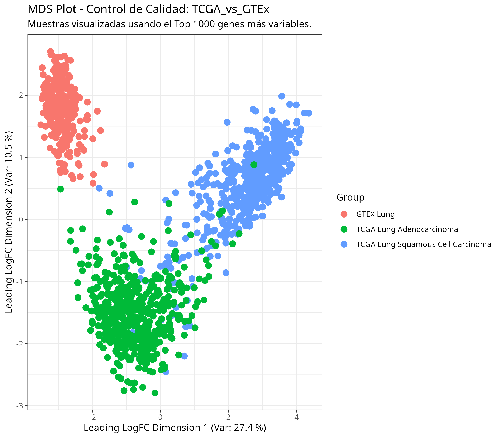
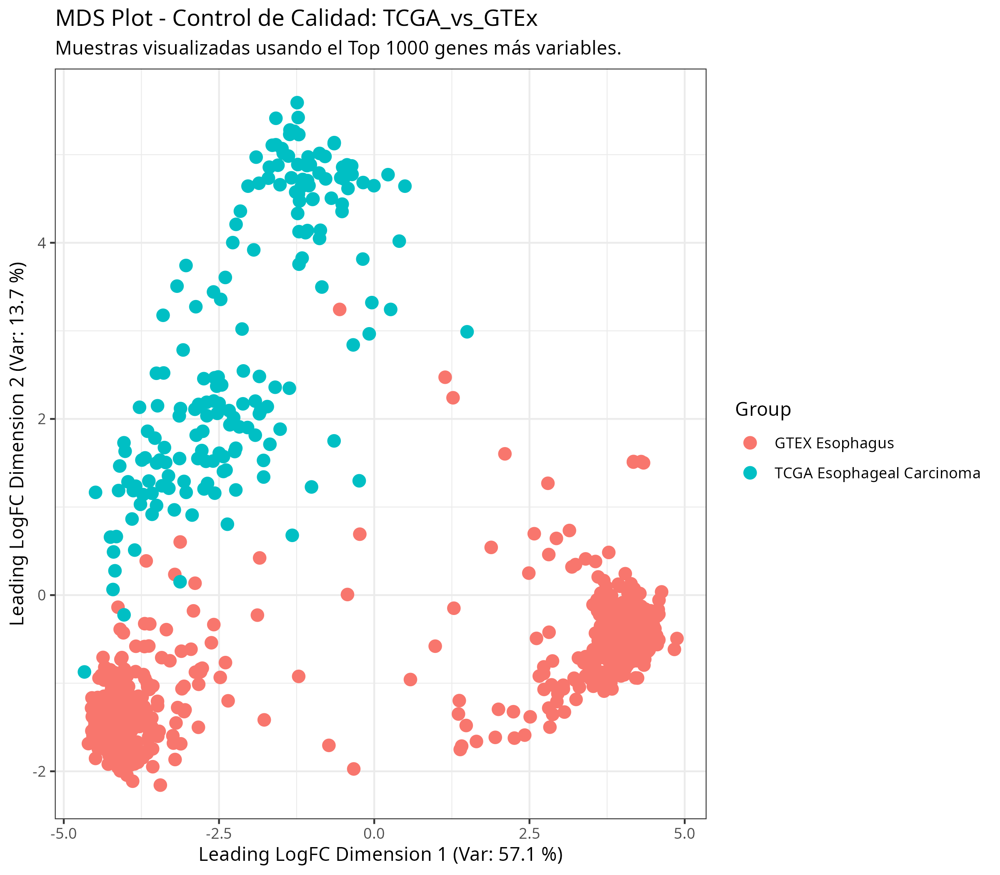
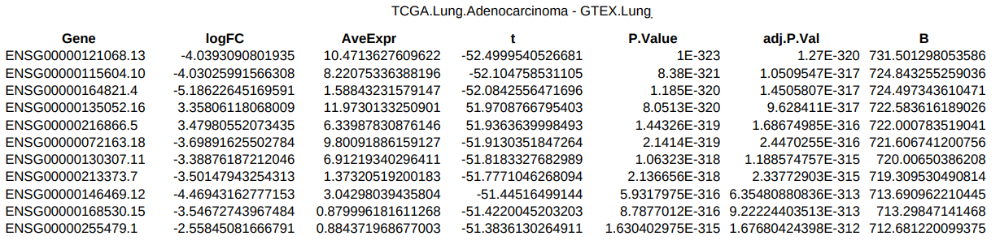
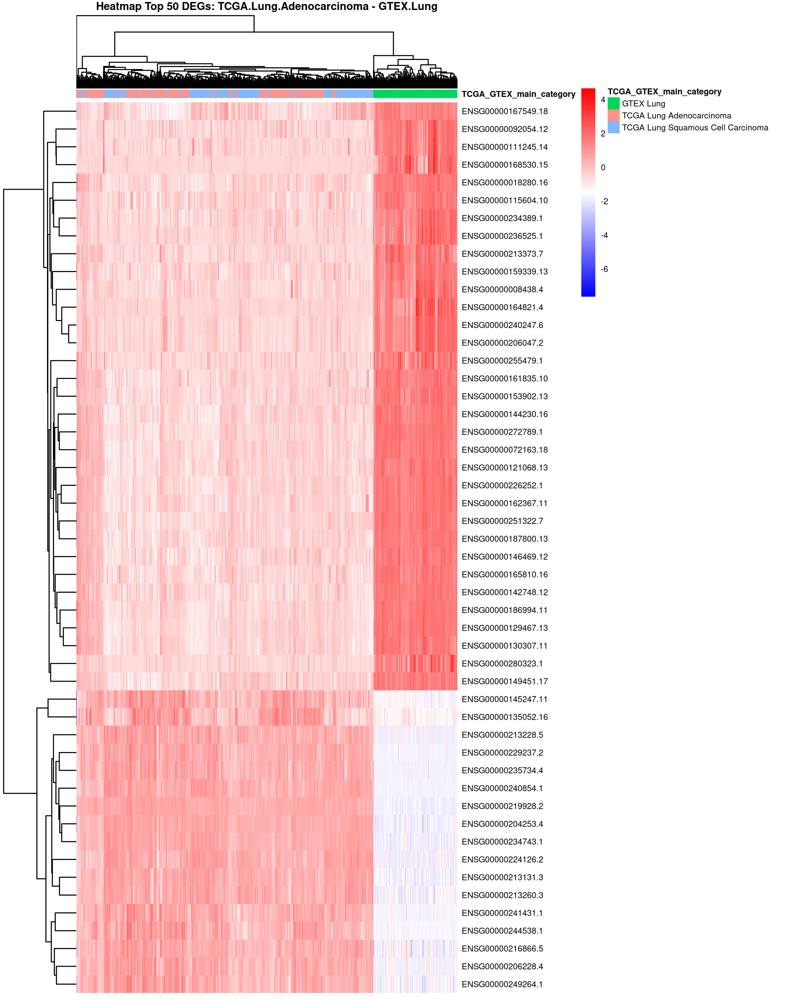

# Documentación Técnica: Interpretacion de resutlados

## Grafico de analisis de componentes principales

El dataset UCSC Xena Toil Re-compute, Cohortes: TCGA (tejido tumoral), GTEx (Tejido Normal) utilizado en estos analisis mitiga el *efecto de lote computacional* al procesar todas las muestras (raw reads) bajo un mismo pipeline bioinformático (Toil). Sin embargo, persisten diferencias técnicas por los protocolos de secuenciación de cada consorcio. El PCA actúa como control de calidad (QC) fundamental para validar si la señal biológica supera al ruido técnico remanente.  

Para la generación del gráfico de PCA se aplicó un filtro de varianza para retener únicamente los Top 1000 genes más variables. Esto se hizo para:  

- Maximización de la Señal Biológica: Gran parte de los genes tienen una expresión relativanete constante. Incluirlos diluye la señal y comprime la varianza explicada por los componentes principales.
- Reducción de Ruido: Al enfocarnos en los genes que más cambian entre muestras, garantizamos que la separación visual responda a diferencias biológicas mas robustas (como la distinción Tumor vs. Normal) y no a fluctuaciones de genes con baja expresión.
- Eficiencia Computacional: Reduce la dimensionalidad de la matriz, permitiendo un cálculo ágil sin perder la estructura global de los datos.

### Interpretacion general

Al visualizar el PCA comparando una cohorte de TCGA contra la de GTEx, se esperan observar dos nubes principales separadas a lo largo del Componente Principal 1 (PC1).  

Observación esperada: Una nube de GTEx compacta separada de la nube de TCGA (más dispersa)  

#### Mejoras posibles

Ambigüedad actual: Al no tener diferenciadas las muestras dentro de TCGA entre tejido proveniente del tumor o tejido sano adyacente al tumor, no es posible confirmar si esta separación se debe a:  

- Biología (Deseable): La mayoría de TCGA es tumor y GTEx es tejido sano.
- Efecto de Lote (Indeseable): Diferencias técnicas entre los protocolos de secuenciación de los dos consorcios.

Para validar que la selección de genes y la integración de datasets son correctas, se podrían clasificar las muestras de TCGA en Primary Tumor y Solid Tissue Normal. Esto permitiría verificar el solapamiento de controles: Si las muestras sanas de TCGA se mezclan con las sanas de GTEx usando estos 1000 genes, se confirma que el "Efecto de Lote" es despreciable frente a la señal biológica.

#### Ejemplos de salida

**Ejemplo 1: Análisis de Escalamiento Multidimensional (MDS) para muestras de pulmon**

La gráfica presenta la proyección de las muestras en un espacio bidimensional calculado a partir de los Top 1000 genes más variables del dataset unificado. Los ejes representan las dimensiones principales de variación transcriptómica (Dimensión 1: 27.4% y Dimensión 2: 10.5%).  

1. Control Sano (GTEx Lung - Rojo):
   Se observa en el cuadrante superior izquierdo formando un cluster compacto y denso.  
   Esto indica una alta homogeneidad transcriptómica entre los individuos sanos. El tejido pulmonar normal tiene un perfil de expresión muy conservado y estable. Validación: Su clara separación de los grupos tumorales confirma que la distinción "Sano vs. Enfermo" es la señal predominante.
2. Diferenciación de Subtipos Tumorales (TCGA - Verde y Azul):
   Las muestras tumorales no forman una única nube, sino que se bifurcan claramente en dos direcciones distintas, formando una estructura en "V" o triangular junto con el control.  
   Adenocarcinoma (Verde): Se segrega hacia la parte inferior.  
   Carcinoma Escamoso (Azul): Se segrega hacia la derecha.  
   El análisis es lo suficientemente sensible para capturar la histología celular. A pesar de que ambos son cánceres de pulmón y provienen del mismo estudio (TCGA), sus perfiles de expresión son distintos, validando que la agrupación responde a la biología del tumor y no solo al origen del estudio (Batch Effect).
3. Heterogeneidad Tumoral:
   A diferencia del grupo sano (rojo), las nubes verde y azul son más dispersas. Esto refleja la naturaleza caótica y heterogénea del cáncer, cada paciente presenta mutaciones y perfiles de expresión más variables que en el tejido sano.

Este es un ejemplo de un analisis de control de calidad muy bueno: *La estructura topológica observada en el MDS plot valida la idoneidad del dataset para el Análisis de Expresión Diferencial (DEA)*  

**Aclaracion**: Aunque no se puede descartar un efecto de lote residual inherente al origen de los consorcios (TCGA vs. GTEx), la estructura topológica del PCA demuestra que la varianza biológica predomina sobre la varianza técnica. Esto se evidencia en la clara segregación de los subtipos histológicos dentro de la cohorte TCGA (Adenocarcinoma vs. Carcinoma Escamoso), lo que indica que el perfil transcriptómico preserva la señal biológica necesaria para el análisis diferencial.

**Ejemplo 2: Esófago (Heterogeneidad en el Control)**

La gráfica muestra la proyección de muestras de Esófago (GTEx Normal vs TCGA Carcinoma) utilizando los Top 1000 genes más variables. A diferencia del ejemplo de Pulmón, la distribución no es triangular ni compacta.  

1. El Problema del Control (GTEx Esophagus - Rojo):
   Observación: El grupo de control sano no forma un único clúster compacto. En su lugar, presenta una distribución "bimodal" o alargada a lo largo de la Dimensión 1, con dos núcleos de densidad (uno a la izquierda y otro a la derecha) conectados por un puente de muestras dispersas.  
   Significado Biológico: Esto indica que la etiqueta "Esophagus" en GTEx engloba dos tejidos biológicamente distintos. Anatómicamente, el esófago tiene capas muy diferenciadas: Mucosa (epitelio) y Muscularis (músculo). Es muy probable que el clúster de la derecha corresponda a tejido muscular y el de la izquierda a mucosa epitelial.  
   Riesgo: Tratar a todas las muestras rojas como un único grupo "Normal" es estadísticamente incorrecto, ya que se estaría promediando la expresión de dos tejidos diferentes.
2. Relación Tumor-Normal (TCGA - Turquesa):  
   Observación: Las muestras tumorales (TCGA) se alinean verticalmente sobre el lado izquierdo del gráfico, solapándose parcialmente con el subgrupo izquierdo de GTEx, pero están totalmente alejadas del subgrupo derecho de GTEx.  
   Interpretación posible: El cáncer de esófago surge del epitelio (mucosa). Por eso, los tumores se parecen más a la Mucosa Normal (lado izquierdo) que a la Muscularis (lado derecho).  

Veredicto de Idoneidad para DEA: Bajo. Requiere curacion previa. Un PCA disperso en el grupo de control (GTEx) alerta sobre heterogeneidad tisular oculta. En este caso, puede haber pasado que se mezclaron capas histológicas distintas (mucosa vs. muscular) y ésto contamina la línea base.  

Regla de Oro: Si el grupo 'Normal' se divide en dos islas separadas en el PCA, NO proceder al DEA sin antes investigar y subdividir los controles en la metadata. Comparar cáncer contra el tejido normal incorrecto (ej. Carcinoma vs. Músculo) invalidará los resultados biológicos.  

**Guia Resumen**

Teniendo en cuenta la limitacion actual que es la ausencia de muestras "Solid Tissue Normal" dentro de la cohorte TCGA para validación interna, podriamos encontrarnos con dos escenarios:  

**ESCENARIO A: Comparación Binaria (2 Grupos)**  

Configuración: 1 Cohorte GTEx (Normal) vs. 1 Cohorte TCGA (Tumor Global). Ejemplo: GTEx Skin vs. TCGA Melanoma.  

1. WARNING PLOT: El Gráfico de "Vías de Tren"  
   Visualización: Dos nubes alargadas y paralelas, separadas por un gran vacío en el eje PC1. No hay convergencia ni puntos intermedios.  
   Diagnóstico: Separación perfecta.  
   Interpretación: El PC1 captura tanto la diferencia biológica (Sano vs. Cáncer) como la técnica (GTEx vs. TCGA). Al ser binario, no podemos "desenredar" cuánto pesa cada factor.  
   Acción:  
   - Proceder con Cautela: Se asume que la biología es el factor dominante debido a la naturaleza drástica del cáncer y a la reduccion de efecto de lote del dataset utilizado.  
   - Filtro Estricto: En el DEA, aplicar un corte de LogFC alto (ej. > 2) para asegurar que los genes seleccionados tengan una diferencia biológica masiva que supere cualquier ruido técnico de fondo.
2. BAD PLOT: El Gráfico de "Control Roto"
   Visualización: La nube de GTEx no es compacta, sino que se divide en dos o más islas separadas (bimodalidad).  
   La nube de TCGA se alinea solo con una de ellas.  
   Diagnóstico: Heterogeneidad del Tejido Control.  
   Interpretación: La etiqueta "Normal" en GTEx contiene sub-tejidos distintos (ej. Mucosa vs. Músculo). Comparar el tumor contra la mezcla de ambos generará resultados falsos.  
   Acción: No proceder con el DEA, investigar la metadata de GTEx, filtrar el sub-tejido incorrecto y repetir el PCA.  
3. GOOD PLOT: El Gráfico "Compacto vs Disperso"
   Visualización: GTEx forma una bola densa y pequeña.  
   TCGA forma una nube mas amplia y dispersa.  
   Interpretación: La diferencia de dispersión sugiere que estamos capturando la homeostasis estricta del tejido sano (GTEx) frente a la heterogeneidad caótica del cáncer (TCGA), lo cual es una firma biológica correcta.  
   Acción: Proceder al DEA.  

**ESCENARIO B: Comparación de Subtipos (3 Grupos)**  

Configuración: 1 Cohorte GTEx (Normal) vs. 2 Subtipos de TCGA (Ej. Adenocarcinoma y Escamoso). Ejemplo: GTEx Lung vs. TCGA LUAD + TCGA LUSC.  
Este es el escenario ideal. La presencia de dos grupos dentro de TCGA actúa como un control interno de la sensibilidad biológica del dataset.

1. GOOD PLOT: El Gráfico "Triangular" o en "V"
   GTEx se ubica en un extremo (vértice). Los dos subtipos de TCGA se separan entre sí, formando los otros dos vértices de un triángulo.  
   Diagnóstico: Predominio Biológico.  
   Interpretación: El hecho de que el algoritmo separe a los dos grupos de TCGA entre sí demuestra que la señal biológica (histología) es más fuerte que el efecto de lote. Si el efecto de lote fuera dominante, los dos grupos de TCGA estarían mezclados en una sola masa indistinguible.  
   Acción: PROCEDER CON CONFIANZA. Es la mejor validación posible sin controles internos.
2. WARNING PLOT: El Gráfico de "Tumor Indistinguible"
   Visualización: GTEx está separado, pero los dos subtipos de TCGA están completamente mezclados en una sola nube, solapándose totalmente.  
   Diagnóstico: Baja Sensibilidad o Batch Effect Dominante.  
   Interpretación:  
   - Opción A: Los subtipos son molecularmente idénticos (poco probable en histologías distintas).
   - Opción B: El efecto de lote de TCGA es tan fuerte que "aplasta" las diferencias sutiles entre los subtipos, agrupándolos solo por ser del mismo estudio.  
   Acción: Revisar si la selección de genes (Top 1000) es adecuada. Si persiste, el DEA entre subtipos (Tumor A vs Tumor B) no será confiable, aunque el DEA (Tumor vs Normal) podría seguir siendo válido.
3. BAD PLOT: El Gráfico de "Mezcla Cruzada"
   Visualización: Uno de los subtipos de TCGA se agrupa más cerca de GTEx que del otro subtipo de TCGA.  
   Diagnóstico: Inconsistencia Biológica severa.  
   Interpretación: Sugiere que un subtipo tumoral podría estar mal clasificado, tener muy baja pureza (ser casi tejido normal) o que el tejido GTEx seleccionado se parece más a un cáncer que al otro.  
   Acción: Auditar las muestras y la biología del tejido antes de avanzar.  

**Tabla de decision rapida**

| Escenario | Topología Visual (Lo que ves) | Diagnóstico | Acción / Veredicto |
|-----------|-------------------------------|-------------|-------------------|
| 3 Grupos (Ideal) | Triangular / En "V": GTEx en una punta, los dos subtipos de TCGA separados en otras puntas. | Excelente. La biología (histología) vence al efecto de lote. | ✅ PROCEDER. Confianza alta para cualquier DEA. |
| 3 Grupos | Subtipos Mezclados: GTEx separado, pero los dos subtipos de TCGA forman una sola nube revuelta. | Parcial. Distingue Sano vs. Enfermo, pero no distingue subtipos de cáncer. | ⚠️ PRECAUCIÓN. Apto solo para Tumor vs. Normal. No comparar subtipos entre sí. |
| 2 Grupos | Islas Paralelas (Gap): GTEx y TCGA separados por un vacío enorme. Nubes alargadas y paralelas. | Ambiguo. Mezcla de Biología y Efecto de Lote. No hay validación interna. | ⚠️ PRECAUCIÓN. Proceder usando filtro estricto (LogFC > 2). |
| Cualquiera | Control Bimodal: La nube de GTEx (Sano) se parte en dos o más islas separadas. | Error de Tejido. GTEx contiene sub-tejidos distintos (ej. Mucosa vs Músculo). | ⛔ STOP. Filtrar metadata de GTEx y repetir PCA. |
| Cualquiera | Solapamiento Tumor-Normal: GTEx (Sano) y TCGA (Tumor) mezclados en una única masa sin orden. | Pérdida de Señal. Error de etiquetado o datos corruptos. No hay diferencia biológica visible. | ⛔ STOP. Auditar datos antes de proceder. |

## Tablas de Resultados de Expresión Diferencial (DEA)

La tabla de resultados constituye el núcleo cuantitativo del análisis. Contiene las métricas estadísticas que permiten jerarquizar los genes según su probabilidad de estar vinculados a la diferencia biológica estudiada (ej. Adenocarcinoma vs. Tejido Sano).

### Estructura de la Tabla

| Columna    | Definición                                                  | Relevancia                                           |
|------------|------------------------------------------------------------|-----------------------------------------------------|
| Gene       | Identificador del gen (Ensembl ID).          | Identidad biológica.                                |
| logFC      | Log2 Fold Change.                                          | Magnitud y dirección del cambio.                    |
| AveExpr    | Promedio de expresión logarítmica.                        | Nivel de expresión basal del gen en todas las muestras. |
| t          | Estadístico t moderado.                                   | Relación entre el cambio observado y la variabilidad. |
| P.Value    | P-valor nominal.                                          | Significancia estadística sin corregir.            |
| adj.P.Val  | P-valor ajustado (FDR).                                  | Significancia estadística corregida por comparaciones múltiples. |
| B          | Estadístico B (Log-odds).                                 | Probabilidad logarítmica de que el gen esté realmente expresado diferencialmente. |

Ordenamiento: La tabla se entrega ordenada de forma ascendente por la columna adj.P.Val. Esto coloca los genes más robustos estadísticamente en las primeras filas (Top DEGs).  

### Interpretación de Resultados

Para que un gen sea considerado un candidato sólido, se recomienda observar la convergencia de tres métricas:  

1. Significancia: El adj.P.Val debe ser menor al umbral (default 0.05).  
2. Magnitud: El logFC debe ser lo suficientemente alto (usualmente |logFC| > 1).  
3. Consistencia (Estadístico B - Log-odds): Es una métrica específica de la estadística bayesiana de limma y representa el logaritmo de las de probabilidades (log-odds) de que un gen sea diferencialmente expresado frente a que no lo sea. Si B = 0, la probabilidad de que el gen sea DE es del 50%. A medida que B aumenta, la certeza aumenta de forma logarítmica. Es una medida más conservadora que el p-valor y es excelente para desempatar genes que tienen p-valores ajustados idénticos (muy comunes en datasets grandes como TCGA). Para publicaciones o hallazgos **robustos** en TCGA/GTEx, buscar un B > 3 (95% de probabilidad) o B > 4 (99% de probabilidad). Nota: En comparaciones donde el p-adj está 'saturado' con el mismo valor mínimo muy debajo de 0, el estadístico B es la única métrica confiable para rankear los genes de mayor a menor importancia biológica.  
4. AveExpr como Filtro de Calidad: La columna AveExpr ayuda a contextualizar el resultado.
   1. Genes con baja AveExpr: Suelen tener p-valores menos estables. Si un gen importante tiene una expresión promedio muy baja, es recomendable verificar su distribución en los conteos crudos (boxplot de expresión por grupo).  
   2. Genes con alta AveExpr: Son biológicamente más propensos a tener un impacto funcional real en la célula, ya que sus transcritos son abundantes.  
5. Relación entre 't' y 'logFC': El estadístico t es el cociente entre el logFC y su error estándar. Un logFC alto con un t bajo indica que el gen varía demasiado entre las réplicas de un mismo grupo, lo que resta confiabilidad al hallazgo. Por el contrario, un t alto garantiza que la diferencia entre grupos es mucho mayor que la variabilidad interna.  
   Es fundamental verificar que el signo de t y logFC sea siempre el mismo: Un t positivo con un logFC positivo indica sobreexpresión en el grupo de interés respecto al de referencia. Si los signos no coinciden, es una señal de alerta sobre la estabilidad del modelo en ese gen en particular.

#### Ejemplo de salida

Figura: Tabla de resultados ordenada por adj.P.Val ascendente. Las columnas muestran Gene, logFC, AveExpr, t, P.Value, adj.P.Val, y B. Los genes en las primeras filas son los Top DEGs con mayor robustez estadística.

## Heatmap

Esta seccion describe los principios técnicos y biológicos para interpretar los mapas de calor generados por la función ***create_heatmap*** dentro del archivo `dea_functions.R`. Esta funcion fue diseñada para visualizar los genes diferencialmente expresados (DEGs) obtenidos mediante un análisis de expresión diferencial (DEA) entre cohortes de TCGA y GTEx.  

El heatmap es una representación sintética de la matriz de expresión. A diferencia de una tabla de datos, permite visualizar la consistencia biológica entre réplicas y detectar patrones de co-expresión génica.  

El objetivo es representar la intensidad de expresión de los Top N genes más significativos, permitiendo observar patrones de agrupamiento entre las muestras analizadas.  

### Parámetros de Entrada

| Parámetro | Tipo | Descripción |
|---|---:|---|
| full_matrix | Matrix | Matriz de expresión donde las filas son genes y las columnas muestras. |
| results_df | Data.frame | Tabla de resultados del DEA (salida de limma) que debe contener columnas logFC y adj.P.Val. |
| metadata | Data.frame | Datos clínicos/anotaciones de las muestras. |
| group_col | String | Nombre de la columna en la metadata que define los grupos (ej. "TCGA_GTEX_main_category"). |
| comparison_name | String | Título descriptivo para el gráfico y nombre de archivo. |
| top_n | Integer | Cantidad de genes con menor p-value ajustado a mostrar. |
| logFC_threshold | Numeric | Umbral mínimo de Fold Change para considerar un gen como relevante. |
| p_threshold | Numeric | Umbral máximo de p-value ajustado (FDR). |

### Lógica de Procesamiento Interno

El codigo realiza tres procesos críticos antes de pintar el gráfico:  

1. Filtrado de Significancia: Selecciona solo los 50 genes que tienen mayor relevancia estadística (adj.P.Val < 0.05) y un cambio de magnitud importante (|logFC| > 1). Los genes resultantes se ordenan por significancia y se seleccionan los primeros top_n.  
2. Normalización Z-score: Esto transforma los valores de conteo en unidades de desviación estándar.Un valor de 2 (rojo) significa que ese gen se expresa 2 desviaciones estándar por encima de su media en esa muestra.Un valor de -2 (azul) significa que está muy por debajo de su media. [Ver sección Consideraciones Estadísticas Avanzadas](#consideraciones-estadísticas-avanzadas).  
3. Anotación y Clustering Jerárquico: Organiza las filas y columnas por similitud, agrupando lo que se comporta de forma parecida:
   1. Clustering Jerárquico: Se aplica tanto a filas como a columnas utilizando la distancia euclidiana por defecto. Esto agrupa automáticamente muestras con perfiles de expresión similares.
   2. Anotación: Se añade una barra de color superior basada en la metadata para identificar visualmente a qué grupo pertenece cada muestra.

### Interpretación de Resultados

1. Escala de Colores (Z-Score)
   - Rojo (Positivo): Indica que el gen está sobreexpresado (up-regulated) en esa muestra en comparación con el promedio de todas las muestras del heatmap.  
   - Azul (Negativo): Indica que el gen está subexpresado (down-regulated) respecto al promedio.  
   - Blanco: Expresión cercana a la media.  
2. Agrupamiento de Columnas (Muestras)  
   Si el DEA es biológicamente robusto, el dendrograma superior debería separar claramente las muestras por su categoría (ej. el bloque de muestras de Adenocarcinoma debería agruparse lejos de las muestras de tejido normal de GTEx). Si las muestras aparecen mezcladas, podría indicar:  
   1. Baja pureza tumoral en las muestras de TCGA.  
   2. Efecto de lote (batch effect) entre TCGA y GTEx.  
   3. Heterogeneidad biológica intrínseca.  
   Ver seccion [Consideraciones Estadísticas Avanzadas](#consideraciones-estadísticas-avanzadas) para entender la relacion del grafico PCA con este agrupamiento.  
3. Agrupamiento de Filas (Genes)  
   Los genes que se agrupan juntos suelen compartir funciones biológicas o vías de señalización. El heatmap permite identificar visualmente "firmas génicas" o bloques de genes que se activan o desactivan de manera coordinada entre las patologías analizadas (ej. Tejido Sano de Pulmon vs Squamous Cell Carcinoma).

#### Ejemplo de salida

A continuación se muestra el heatmap generado para la comparación TCGA Lung Adenocarcinoma vs GTEx Lung (Top 50 genes):

Figura: Heatmap con valores Z-score por gen (filas) y muestras (columnas). Colores: rojo = sobreexpresión relativa, azul = subexpresión relativa. Las barras de color superiores representan la anotación por grupo. Los dendrogramas indican agrupamientos jerárquicos; ramas cercanas reflejan perfiles de expresión similares.

### Consideraciones Estadísticas Avanzadas

1. Rango de la Normalización Z-score  
   Es un error pensar que el Z-score está limitado al rango [-2, 2]. Matemáticamente, el Z-score no tiene un límite superior o inferior definido; depende totalmente de la distribución de los datos originales. La fórmula aplicada es: Z = (X-μ)/σ.  
   Interpretación probabilística: Si los datos siguieran una distribución normal perfecta, el 95% de los valores caerían entre -1.96 y 1.96. Debido a la alta variabilidad biológica y técnica, es frecuente encontrar valores fuera de este rango (outliers). Si un gen tiene un Z-score de 4, significa que su expresión en esa muestra es 4 desviaciones estándar por encima de la media, lo cual es un hallazgo biológicamente potente.  
   Visualización: En el heatmap, los colores suelen saturarse en los extremos (ej. todo lo mayor a 2 es rojo intenso y menor a -2 es azul intenso) para evitar que un solo outlier opaque la variación del resto de las muestras.

2. Correlación entre Clustering y PCA  
   El Agrupamiento Jerárquico de columnas en el heatmap y el Análisis de Componentes Principales (PCA) son herramientas complementarias pero operan bajo la misma premisa: la distancia biológica.
   La logica diría que si en el PCA se ve que las muestras de "GTEX.Lung" se separan claramente de las de "TCGA.Lung.Adenocarcinoma" en el componente principal 1 (PC1), el heatmap debe reflejar esto agrupando esas muestras en ramas separadas del dendrograma superior. Pero hay una diferencia clave: Mientras que el PCA utiliza la variabilidad de los 1000 genes más variables para posicionar las muestras en un plano, el heatmap se enfoca específicamente en los genes que ya sabemos que son distintos (los DEGs):  
   - Si el PCA muestra separación pero el heatmap no, es posible que el umbral de significancia del DEA sea demasiado laxo. 
   - Si el heatmap agrupa mejor que el PCA, significa que los DEGs seleccionados son los que realmente definen la identidad del tejido.

3. Lógica de Selección de Genes vs. Visualización
    Es fundamental distinguir entre cómo el modelo estadístico elige los genes y qué muestras se muestran en el gráfico:
    - Selección de Genes (El Contraste): Los genes se filtran basándose en un contraste estadístico específico (ej. Grupo A vs. Grupo B). El resultado (LogFC y p-valor) se calcula solo con esos dos grupos.
    - Visualización Global: Aunque los genes se eligen por ser diferentes entre A y B, el heatmap incluye a todos los grupos disponibles en la matriz. Esto permite observar el comportamiento de esos genes en una tercera condición (Grupo C), aportando contexto sobre la especificidad de la firma génica.  
    Ejemplo: Cuando incluimos un tercer grupo (ej. un segundo tipo de tumor) que no formó parte del contraste original, podemos obtener tres tipos de información:
    - Especificidad del Marcador: Si los genes son rojos en LUAD, azules en GTEx, y también azules en LUSC, significa que son biomarcadores específicos de Adenocarcinoma.
    - Firma Genérica de Cáncer: Si los genes son rojos tanto en LUAD como en LUSC, pero azules en GTEx, estamos ante una firma de proliferación tumoral general del pulmón.
    - Gradiente Biológico: Permite observar si el tercer grupo tiene un perfil intermedio, lo cual es común en estudios de progresión de enfermedades.

## Volcano Plot

El Volcano Plot es una herramienta de visualización bidimensional que permite identificar rápidamente los genes con cambios de expresión biológicamente significativos y estadísticamente robustos. Combina una medida de significancia estadística con la magnitud del cambio (Fold Change).

### Parámetros de Entrada

| Parámetro | Tipo | Descripción |
|---|---:|---|
| results | Data.frame | Tabla de resultados del DEA (salida de limma). |
| p_value_threshold | Numeric | Umbral de significancia para el eje Y (basado en adj.P.Val). |
| logFC_threshold | Numeric | Umbral de magnitud de cambio para el eje X (basado en logFC). |
| title | String | Título principal del gráfico. |
| top_genes_label | Integer | Cantidad de genes (ordenados por significancia) que recibirán etiqueta de texto. |

### Lógica de Procesamiento Interno

1. Categorización Binaria: La función crea una columna lógica *diff_expressed*. Un gen se marca como "YES" únicamente si cumple ambas condiciones simultáneamente: |log2FC| > p_value_threshold y  P-adj < p_value_threshold  
2. Transformación Logarítmica:  
   1. Eje X: Utiliza $log2 para que los cambios sean simétricos (un aumento del doble es +1, una disminución a la mitad es -1).  
   2. Eje Y: Aplica -log10 al valor de p ajustado. Esto permite que los valores más pequeños (más significativos) se ubiquen en la parte superior del gráfico.  
3. Etiquetado Inteligente: Para evitar la saturación visual, la función no etiqueta todos los genes significativos. Filtra el set de datos para identificar solo los *top_genes_label* genes con el p-valor más bajo y utiliza la librería ggrepel para posicionar los nombres sin que se solapen.

### Interpretación de Resultados

El gráfico se divide visualmente en cuadrantes definidos por las líneas punteadas (umbrales):  

- Superior Izquierda (Up-Left): Genes significativamente subexpresados (Down-regulated).
- Superior Derecha (Up-Right): Genes significativamente sobreexpresados (Up-regulated).
- Zona Inferior/Central: Genes que no alcanzan la significancia estadística o cuya magnitud de cambio es despreciable.

#### Ejemplo de salida

Figura: Volcano plot que muestra log2FC (eje X) frente a -log10(adj.P.Val) (eje Y). Los puntos destacados representan genes que superan los umbrales de |logFC| y ajuste de p; las etiquetas señalan los top genes más significativos.

### Consideraciones Estadísticas Avanzadas

1. LogFC vs. Z-Score
   Es importante notar la diferencia entre ambos gráficos:
   - El Heatmap usa Z-score (distancia a la media de la fila) para mostrar cómo varía un gen entre muestras individuales.
   - El Volcano Plot usa Log2 Fold Change (diferencia de medias entre grupos).  